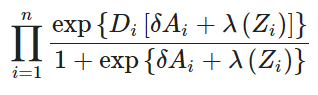

```{r}
library(dplyr)
library(ggplot2)
library(gridExtra)
library(MASS)
library(fitdistrplus)
library(ggstatsplot)
library(tibble)
library(readr)
```

```{r}
setwd("C:/hcgalvan/Repositorios/hcgalvan_project/data/union/End")
temp = gsub(".*target.*", "", readLines("zscore.csv"))
data<-read.table(text=temp, sep=",", header=TRUE)
dz<-data.frame(data[,c("A","label","zscore")])
dz1<-data.frame(data)

```

## Obtener funcion λ en Zi

### función por partes a partir de splines para lambda, selecciono delta con regresion logística estratificada

```{r}
#####Es una forma que realiza el estudio a partir del ratio de varianza se obtiene el delta para la ecuación

ci.or<-logistic.regression.or.ci(reg)
δ<-deviance(reg)/df.residual(reg) # ratio varianza
# coef(reg)
#exp(coef(reg))
# deviance(fit.reduced)/df.residual(fit.reduced)
δ

```

```{r}
# regresion logística condicional o estratificada
# Realizo reg log de label(D) en A con estratos de quantiles obtenidos de zcore.
# En este caso p-valor indica que no es significativo la inferencia obtenida. Lo que hace suponer la baja cantidad de observaciones.
#####
# Existe un problema para lograr delta porque no converge por la cantidad de datos
# z11 <- filter(dz1, label==1)
#########
# Entonces utilizo el total
dz11 <- dz1

dz11$subclass <- cut(x=dz11$zscore,
                              breaks=quantile(dz11$zscore, 
                              prob = seq(0, 1, 1/5)),include.lowest=T)
levels(dz11$subclass) <- 1:length(levels(dz11$subclass))

#### Prueba #####
dz11
survival.clogit <-clogit(label~A+strata(subclass),data=dz11)
summary(survival.clogit)
delta = coefficients(survival.clogit)[[1]]
```

#### Genero la productoria - Modelo final

```{r}
# Función  constante por partes o escalonada
# La idea que entiuendo es: detras es que los valores de puntación de zscore está a partir de los sujetos de estudio, y se arma nudos para capturar las medias o puntos centrales.

# Definida en base a splines // buscando la función
x<-zsc

#cuts <- c( -Inf, -1.793, -1.304, -0.326, 0.625, 1.630, 2.119 )
#vals <- c(    0,  0.454,      0,  0.632,     0, 0.227,     0 )
#fx <- vals[findInterval(x, c(-Inf, cuts))]
#f <- stepfun(cuts[-1], vals)
#fx <- f(x)
##################################################################
#función productoria
productoria <- function(D,delta,A,lamdaz){
   result = prod((exp(D*(delta*A)+lamdaz))/(1+exp((delta*A)+lamdaz)))
   return(result)
}
productoria(1,1,1,1)
## donde D es label donde es 1 = Patologia, 0 sin patología, 
## delta es la varianza de regresion logística estratificada entre A y estratos de los cuantiles de la puntuación de zscore 
## A es Expuesto y no Expuesto, variable dicotómica a partir de distribución densidad de sujetos de control 
## 
v<-c()

# delta = -0.6558704 este valor de delta proviene de reg log estrat

for(i in 1:nrow(dz1)) {       # for-loop over rows
  v[i] <- (productoria(dz1[i,c("label")], delta, dz1[i,c("A")], dz1[i,c("zscore")]))
}

plot(v)
abline(v=10,col="red")
```


