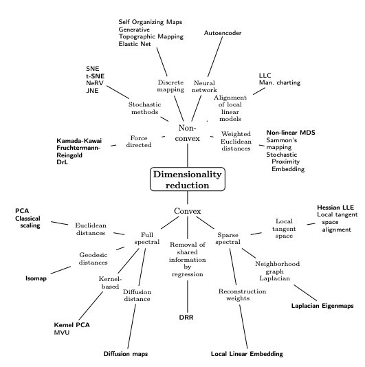

```{r}
library(dplyr)
library(ggplot2)
library(gridExtra)
library(MASS)
library(fitdistrplus)
library(ggstatsplot)
library(tibble)
library(readr)
```

```         
```

```{r}

setwd("C:/hcgalvan/Repositorios/hcgalvan_project/data/union/End")
temp = gsub(".*target.*", "", readLines("seleccionestudio.csv"))
temp1 = gsub(".*target.*", "", readLines("integrado.csv"))
temp2 = gsub(".*target.*", "", readLines("dataset_final_cobre.csv"))
datacobre<-read.table(text=temp2, sep=",", header=TRUE) # No puedo usar cobre porque faltan tractos
data<-read.table(text=temp, sep=",", header=TRUE)
dataf<-data.frame(data)
data1<-read.table(text=temp1, sep=",", header=TRUE)
dataf1<-data.frame(data1)
dim(data)
datacobre$label
```

```{r}
confus<- dataf1[,c("sl2l_qa", "sl2l_iso", "ccbd_iso", "ccbd_qa", "ifol_qa", "ifol_iso", "ecpl_qa", "ecpl_iso", "tral_qa", "tral_iso", "afsl_qa", "afsl_iso", "afsr_qa", "afsr_iso", "cfpl_iso", "cfpl_qa", "cfpr_iso", "cfpr_qa", "fatl_iso", "fatl_qa", "fatr_iso", "fatr_qa", "slfl_iso", "slfl_qa", "slfr_iso", "slfr_qa", "tral_iso", "tral_qa", "ufsl_iso", "ufsl_qa", "ufsr_iso", "ufsr_qa", "age", "gender_F", "gender_M")]
confus
```

```{r}
### False = No Expuesto = 0; True = Expuesto = 1
dataf<- dataf %>% 
  mutate(sl2ldmExp = if_else((dataf$sl2l_diameter > 22.10 & dataf$sl2l_diameter < 24.42), 0, 1))

dataf<- dataf %>% 
  mutate(ccbdmExp = if_else((dataf$ccbd_diameter > 14.68 & dataf$ccbd_diameter < 16.51), 0, 1))

dataf<- dataf %>% 
  mutate(ifoldmExp = if_else((dataf$ifol_diameter > 14.68 & dataf$ifol_diameter < 16.51), 0, 1))

dataf<- dataf %>% 
  mutate(ecplvlExp = if_else((dataf$ecpl_volume > 6455 & dataf$ecpl_volume < 8918), 0, 1))

dataf<- dataf %>% 
  mutate(tralvlExp = if_else((dataf$tral_volume > 12366 & dataf$tral_volume < 18004), 0, 1))

dataf<- dataf %>% 
  mutate(sl2lmlExp = if_else((dataf$sl2l_mean_length > 72.18 & dataf$sl2l_mean_length < 80.61), 0, 1))

dataf<- dataf %>% 
  mutate(ccbdmlExp = if_else((dataf$ccbd_mean_length > 112.62 & dataf$ccbd_mean_length < 123.81), 0, 1))
dataf
```

```{r}
dataf<- dataf %>% 
  mutate(A = if_else((dataf$sl2ldmExp==1 & dataf$sl2lmlExp==1 & dataf$ccbdmExp==1 & dataf$ccbdmlExp==1 & dataf$tralvlExp==1),1, 0)) # No agrego ecpl porque contiene mucho ruido
dataf<- dataf %>% 
  mutate(A1 = if_else((dataf$sl2ldmExp==1 & dataf$sl2lmlExp==1 & dataf$ccbdmExp==1 & dataf$ccbdmlExp==1 & dataf$tralvlExp==1 & dataf$ifoldmExp ==1),1, 0)) # No agrego ecpl porque contiene mucho ruido
filter(dataf, A==1)


############################################
dataf<- dataf %>% 
  mutate(A1 = if_else(dataf$sl2ldmExp==1 & dataf$ccbdmExp==1 & dataf$ifoldmExp==1 & dataf$ecplvlExp==1 & dataf$tralvlExp==1 & dataf$ccbdmlExp==1),1,0)

filter(dataf, sl2ldmExp==1 & ccbdmExp==1 & ifoldmExp==1)
filter(dataf, sl2ldmExp==1) # 58 observ
filter(dataf, ccbdmExp==1) # 95 observ
filter(dataf, ifoldmExp==1) # 57 observ
filter(dataf, ecplvlExp==1) # 54 observ
filter(dataf, sl2ldmExp==1 & sl2lmlExp==1) #A
filter(dataf, sl2ldmExp==1 & sl2lmlExp==1 & ccbdmExp==1) #A
filter(dataf, sl2ldmExp==1 & sl2lmlExp==1 & ccbdmExp==1  & ccbdmlExp==1) #A
filter(dataf, sl2ldmExp==1 & sl2lmlExp==1 & ccbdmExp==1  & ccbdmlExp==1  & tralvlExp==1) #A
filter(dataf, sl2ldmExp==1 & sl2lmlExp==1 & ccbdmExp==1  & ccbdmlExp==1  & tralvlExp==1) #A
filter(dataf, sl2ldmExp==1 & sl2lmlExp==1 & ccbdmExp==1  & ccbdmlExp==1  & tralvlExp==1  & ifoldmExp==1 ) #A
filter(dataf, sl2ldmExp==1 & sl2lmlExp==1 & ccbdmExp==1 & ifoldmExp==1 & ecplvlExp==1 & tralvlExp==1) #A
filter(dataf, sl2ldmExp==1 & ccbdmExp==1 & ifoldmExp==1 & ecplvlExp==1 & tralvlExp==1) #A
filter(dataf, sl2ldmExp==1 & ccbdmExp==1 & ifoldmExp==1 & ecplvlExp==1 & tralvlExp==1 & ccbdmlExp==1) #A1
filter(dataf, sl2ldmExp==1 & ccbdmExp==1 & ifoldmExp==1 & ecplvlExp==1 & tralvlExp==1 & ccbdmlExp==1 & sl2lmlExp==1 )
plot(dataf$sl2ldmExp)
```

```{data}
```

```{r}

t <- dataf1[,c("sl2l_qa", "sl2l_iso", "ccbd_iso", "ccbd_qa", "ifol_qa", "ifol_iso", "ecpl_qa", "ecpl_iso", "tral_qa", "tral_iso", "afsl_qa", "afsl_iso", "afsr_qa", "afsr_iso", "cfpl_iso", "cfpl_qa", "cfpr_iso", "cfpr_qa", "fatl_iso", "fatl_qa", "fatr_iso", "fatr_qa", "slfl_iso", "slfl_qa", "slfr_iso", "slfr_qa", "tral_iso", "tral_qa", "ufsl_iso", "ufsl_qa", "ufsr_iso", "ufsr_qa", "age", "gender_F", "gender_M")]

```

Regresión logística con variables confusoras

```{r}
t
#t$gender_F
t$gend_F <- ifelse(t$gender_F == "True", 1, 0)
#t$gend_F
# t$gend_M <- ifelse(t$gender_M == "True", 1, 0)
t <- subset(t, select = -c(gender_F, gender_M))

t1<- t[,c("sl2l_qa", "sl2l_iso", "ccbd_iso", "ccbd_qa", "ifol_qa", "ifol_iso", "ecpl_qa", "ecpl_iso", "tral_qa", "tral_iso", "afsl_qa", "afsl_iso", "afsr_qa", "afsr_iso", "cfpl_iso", "cfpl_qa", "cfpr_iso", "cfpr_qa", "fatl_iso", "fatl_qa", "fatr_iso", "fatr_qa", "slfl_iso", "slfl_qa", "slfr_iso", "slfr_qa", "tral_iso", "tral_qa", "ufsl_iso", "ufsl_qa", "ufsr_iso", "ufsr_qa", "age","gend_F")]

```

#### Reducción de dimensionalidad



 

```{r}

t1_scale = scale(t1)
# t1_scale
#t1_sc <-data.frame(t1_scale)
#t1_sc$gend_F <- t$gend_F
#t1_sc$gend_M <- t$gend_M
#t1_sc$gend_F
```

```{r}
pca_zq <- prcomp(t1_scale, scale = FALSE) ## aquí escalo y realiza primeras componentes
names(pca_zq)
head(pca_zq$rotation)[, 1:33]
dim(pca_zq$rotation)
# Varianza explicada por cada componente
pca_zq$sdev^2
# Regla de Kaiser y retener aquellos factores con un valor propio mayor que uno
ev <- eigen(cor(t1_scale))
ev$values
summary(pca_zq)
```

```{r}
# Cálculo de la varianza explicada acumulada 
prop_varianza <- pca_zq$sdev^2/sum(pca_zq$sdev^2)
prop_varianza_acum <- cumsum(prop_varianza)
ggplot(data = data.frame(prop_varianza_acum, pc = factor(1:34)),
       aes(x = pc, y = prop_varianza_acum, group = 1)) +
  geom_point() +
  geom_line() +
  geom_label(aes(label = round(prop_varianza_acum,2))) +
  theme_bw() +
  labs(x = "Componentes principales", 
       y = "Prop. varianza explicada acumulada")
```

#### Sobre Analisis Factorial

El comando `KMO()` ejecuta la prueba de Kaiser-Meyer Olkin para comprobar la adecuación de los datos de cara a realizar un análisis factorial. Kaiser proporcionó los siguientes valores para interpretar estos resultados del valor de KMO:

-   0.00 a 0.49 inaceptable6

-   0.50 a 0.59 miserable

-   0.60 a 0.69 mediocre

-   0.70 a 0.79 regular

-   0.80 a 0.89 meritorio

-   0.90 a 1.00 maravilloso

```{r}
library(RcmdrMisc)
KMO(t1_scale)
```

Lo que muestra lo mediocre de realizar el análisis factorial en temas de disminución de dimension

```{r}
library(psych)
fa1.info<- fa.parallel(cor(t1_scale), n.obs=nrow(t1_scale), n.iter=100, main="Scree plots with parallel analysis")
#fa.info <- fa.parallel.poly(t)
#summary(fa.info)
summary(fa1.info)
```

```{r}
library(factoextra)
fviz_screeplot(pca_zq, addlabels = TRUE)
```

```{r}
library(tsne)
library(plotly)
tsne(t1_sc, initial_dims = 2)
set.seed(0)
tsne <- tsne(t1_sc, initial_dims = 2)
tsne <- data.frame(tsne)
pdb <- cbind(t1_sc)
options(warn = -1)
fig <-  plot_ly(data = pdb ,x =  ~X1, y = ~X2, type = 'scatter', mode = 'markers', split = ~t1_sc)

fig <- fig %>%
  layout(
    plot_bgcolor = "#e5ecf6"
  )

fig
```

```{r}
library(RDRToolbox)
t2=data.matrix(t1_scale, rownames.force = NA)
d_low = Isomap(t2, dims=2, k=5, plotResiduals=TRUE)
## Isomap residuals for target dimensions 1-10
d_low1 = Isomap(data=t2, dims=1:7, k=85, plotResiduals=TRUE)	
head(d_low1$dim3)

```

```{r}
simData_dim3_lle = LLE(data=t2, dim=23, k=21)
head(simData_dim3_lle)

```

```{r}
#Laplace
library(Rdimtools)
out1 <- do.lapeig(t2, type=c("proportion",0.25), weighted=FALSE)
plot(out1$Y, pch=19, main="25% connected")
```

```{r}

## two types of graph laplacians using 20% of neighbors
out1 <- do.lapeig(t2,ndim=2,type=c("proportion",0.05),kernelscale=5) # weighted version
out2 <- do.lapeig(t2,ndim=2,type=c("proportion",0.05),weighted=FALSE) # combinatorial

## Visualize
par(mfrow=c(1,2))
plot(out1$Y[,1],out1$Y[,2],main="weighted")
plot(out2$Y[,1],out2$Y[,2],main="combinatorial")
```

#### SPLIT Y TRABAJO

```{r}
#https://github.com/PyRPy/ISLR_R/blob/master/miniProjects/SonarData/template_PCA_LogisticRegression_Sonar_dataset.R
# set seed for reproducibility
# np.random.seed(30300)
# Split data into training and test set, 60% training and 40% test set
#split = np.random.rand(len(dwd)) < 0.6

# define split vector for HOT_DAY
# A_train = dwd["A"][split == 1]
# A_test = dwd["A"][split == 0]

# Sonar dataset - binary classification -----------------------------------
library(caret)
library(mlbench)
#data(dataf)
dataf$A

head(dataf)
table(dataf$A)
dataf$A <- as.factor(dataf$A)

```

```{r}
t2<- t[,c("sl2l_qa", "sl2l_iso", "ccbd_iso", "ccbd_qa", "ifol_qa", "ifol_iso", "ecpl_qa", "ecpl_iso", "tral_qa", "tral_iso", "afsl_qa", "afsl_iso", "afsr_qa", "afsr_iso", "cfpl_iso", "cfpl_qa", "cfpr_iso", "cfpr_qa", "fatl_iso", "fatl_qa", "fatr_iso", "fatr_qa", "slfl_iso", "slfl_qa", "slfr_iso", "slfr_qa", "tral_iso", "tral_qa", "ufsl_iso", "ufsl_qa", "ufsr_iso", "ufsr_qa", "age", "gend_F")]

# t2<- t[,c("sl2l_qa", "sl2l_iso", "ccbd_iso", "ccbd_qa", "ifol_qa", "ifol_iso", "ecpl_qa", "ecpl_iso", "tral_qa", "tral_iso", "afsl_qa", "afsl_iso", "afsr_qa", "afsr_iso", "cfpl_iso", "cfpl_qa", "cfpr_iso", "cfpr_qa", "fatl_iso", "fatl_qa", "fatr_iso", "fatr_qa", "slfl_iso", "slfl_qa", "slfr_iso", "slfr_qa", "tral_iso", "tral_qa", "ufsl_iso", "ufsl_qa", "ufsr_iso", "ufsr_qa", "age")]

t2$A<-dataf$A
t2
```

```{r}
# Split dataset -----------------------------------------------------------

set.seed(107)

inTrain <- createDataPartition(y=dataf$A,
                               p = 0.75,
                               list = FALSE)

training <- t2[inTrain, ]
testing <- t2[-inTrain, ]
nrow(training)
nrow(testing)
training
testing
```

```{r}
# Logistic regression -----------------------------------------------------

logReg <- glm(A~. , data = training, family = "binomial")
# Esta advertencia ocurre a menudo cuando intenta ajustar un modelo de regresión logística en R y experimenta una separación perfecta , es decir, una variable predictiva es capaz de separar perfectamente la variable de respuesta en 0 y 1

logReg
```

```{r}
# Prediction and performance ----------------------------------------------

prob <- predict(logReg, testing, type = "response")
pred <- ifelse(prob > 0.5, 1, 0)
#pred
#prob
table(testing$A, pred)
confusionMatrix(testing$A, as.factor(pred))

as.factor(pred)
```

```{r}
#t1_sc$A<-dataf$A
#t1_sc

#training <- t1_sc[inTrain, ]
#testing <- t1_sc[-inTrain, ]
```

```{r}
# Using PCA preprocessing data --------------------------------------------
# training[,c(-36)]
pca.out <- prcomp(training[,c(-35)],
                  
                  scale. = TRUE)
pca.out
#pca.out
biplot(pca.out, scale = 0)
pca.var <- pca.out$sdev^2

pve <- pca.var/sum(pca.var)
plot(pve, xlab = "Principal component", 
     ylab = "Proportion of variation explained",
     ylim = c(0, 1), 
     type = 'b')

plot(cumsum(pve), xlab = "Principal component", 
     ylab = "Accumulative Prop. of variation explained",
     ylim = c(0, 1), 
     type = 'b')


```

```{r}
# Construct new data frame with PCA selected compoents 1:10 ---------------
#training
mydata <- data.frame(A = training[, "A"], pca.out$x[, 1:5])
#head(mydata)
mydata$A

```

```{r}
# Fit the logistic regressin model again ----------------------------------

logRegPCA <- glm(A ~ .,  data = mydata, family = binomial)
logRegPCA
# Predict the scores on PC1 for the test set data
# head(testing)
test.p <- predict(pca.out, newdata = testing[, 1:35])
#head(test.p)

# Now use that to predict the class
pred <- predict(logRegPCA, newdata = data.frame(test.p[, 1:15]), type = "response")
#test.p[, 1:5]
# cross-classification table 
predA <- factor(ifelse(pred >= 0.5, 1, 0))
#
table(predA)
table(testing$A)

table(testing$A, predA)
testing$A
confusionMatrix(testing$A, as.factor(predA))

# Sensibilidad= 1 significa que tuvo algunos verdaderos positivos y ningún falso negativo: todos los casos reales se predijeron correctamente como positivos

# Especificidad= 0 significa que tuvo algunos falsos positivos y ningún verdadero negativo: todos los no casos reales se predijeron incorrectamente como positivos

# Entonces, tener ambos significa que se predijo que todo sería positivo, ya fuera un caso real o no.


```

### Probando Regresion logística solo para sujetos de estudio

```{r}

ta1<- t[,c("sl2l_qa", "sl2l_iso", "ccbd_iso", "ccbd_qa", "ifol_qa", "ifol_iso", "ecpl_qa", "ecpl_iso", "tral_qa", "tral_iso", "afsl_qa", "afsl_iso", "afsr_qa", "afsr_iso", "cfpl_iso", "cfpl_qa", "cfpr_iso", "cfpr_qa", "fatl_iso", "fatl_qa", "fatr_iso", "fatr_qa", "slfl_iso", "slfl_qa", "slfr_iso", "slfr_qa", "tral_iso", "tral_qa", "ufsl_iso", "ufsl_qa", "ufsr_iso", "ufsr_qa", "age", "gend_F")]

ta2<- t[,c("sl2l_qa", "sl2l_iso","ccbd_iso","ccbd_qa","ifol_qa","ifol_iso","ecpl_qa","ecpl_iso","tral_qa","tral_iso","afsl_qa","afsl_iso","afsr_qa", "afsr_iso","cfpl_iso","cfpl_qa","cfpr_iso","cfpr_qa","fatl_iso","fatl_qa","fatr_iso", "fatr_qa","slfl_iso","slfl_qa", "slfr_iso","slfr_qa", "ufsl_iso", "ufsl_qa", "ufsr_iso", "ufsr_qa","age","gend_F")]
ta2$A<-dataf$A
ta2$label<-dataf$label
tag1<-filter(ta2, label==0) #A
tag1$A <- as.factor(tag1$A)
sum(with(tag1,A==1)) #contar


ta1$A<-dataf$A
write.csv(ta1, "C:\\hcgalvan\\Repositorios\\hcgalvan_project\\data\\union\\End\\cofunds_A.csv", row.names=FALSE)
ta1$label<-dataf$label
tag<-filter(ta1, label==0) #A
tag$A <- as.factor(tag$A)
sum(with(tag,A==1)) #contar
tag1

```

```{r}
### Probando con features que dieron reglog 1
library(caret) #CreateDataPartition
library(mlbench)
inTrain <- createDataPartition(y=tag1$A,
                               p = 0.70,
                               list = FALSE)
training1 <- tag1[inTrain, ]
testing1 <- tag1[-inTrain, ]

trainging_sc1<-as.data.frame(scale(training1[,1:32], center = TRUE, scale = TRUE))
trainging_sc1$A<-training1$A
trainging_sc1

sum(with(trainging_sc1,A==1)) #contar

nrow(training1)
nrow(testing1)
training1
testing1

logReg1 <- glm(A~. , data = trainging_sc1, family = "binomial")
logReg1

prob1 <- predict(logReg1, testing1, type = "response")
pred1 <- ifelse(prob1 > 0.5, 1, 0)
pred1
prob1
table(testing1$A, pred1)
confusionMatrix(testing1$A, as.factor(pred1))

as.factor(pred1)
```

```{r}

inTrain <- createDataPartition(y=tag$A,
                               p = 0.7,
                               list = FALSE)
training <- tag[inTrain, ]
testing <- tag[-inTrain, ]
trainging_sc
trainging_sc<-as.data.frame(scale(training[,1:34], center = TRUE, scale = TRUE))
trainging_sc$A<-training$A
# trainging_sc

pca.out <- prcomp(trainging_sc[,c(1:5)])
pca.out

# Construct new data frame with PCA selected compoents 1:5 ---------------
#training
mydata <- data.frame(A = training[, "A"], pca.out$x[, 1:5])
#head(mydata)
mydata$A

# Fit the logistic regressin model again ----------------------------------

logRegPCA <- glm(A ~ .,  data = mydata, family = binomial)
logRegPCA
# Predict the scores on PC1 for the test set data
# head(testing)
test.p <- predict(pca.out, newdata = testing[, 1:35])
#head(test.p)

# Now use that to predict the class
pred <- predict(logRegPCA, newdata = data.frame(test.p[, 1:12]), type = "response")
summary(pred)
#test.p[, 1:5]
# cross-classification table 
predA <- factor(ifelse(pred >= 0.5, 1, 0))
#
table(predA)
table(testing$A)

table(testing$A, predA)
testing$A
confusionMatrix(testing$A, as.factor(predA))

# Sensibilidad= 1 significa que tuvo algunos verdaderos positivos y ningún falso negativo: todos los casos reales se predijeron correctamente como positivos

# Especificidad= 0 significa que tuvo algunos falsos positivos y ningún verdadero negativo: todos los no casos reales se predijeron incorrectamente como positivos

# Entonces, tener ambos significa que se predijo que todo sería positivo, ya fuera un caso real o no.


```

```{r}
library(caret) #CreateDataPartition
library(mlbench)
inTrain <- createDataPartition(y=tag$A,
                               p = 0.73,
                               list = FALSE)
training <- tag[inTrain, ]
testing <- tag[-inTrain, ]

trainging_sc<-as.data.frame(scale(training[,1:34], center = TRUE, scale = TRUE))
trainging_sc$A<-training$A
trainging_sc

sum(with(trainging_sc,A==1)) #contar

nrow(training)
nrow(testing)
training
testing

logReg <- glm(A~. , data = trainging_sc, family = "binomial")
logReg

prob <- predict(logReg, testing, type = "response")
pred <- ifelse(prob > 0.5, 1, 0)
pred
prob
table(testing$A, pred)
confusionMatrix(testing$A, as.factor(pred))

as.factor(pred)
```

<https://evidenciasenpediatria.es/articulo/7943/regresion-logistica-binaria-simple>

Como resumen, podemos distinguir varias etapas en la RL:

1.  Recodificar las variables independientes categóricas u ordinales y la variable dependiente en 0 y 1.

2.  Ejecutar el modelo de Regresión logística, seleccionando la variable dependiente y la independiente, modelo binomial y función logit.

3.  Analizar la significación del estadístico de Wald para la variable independiente. Un valor *p* \<0,05 significa que la introducción de la variable es significativa.

4.  Analizar la fuerza y sentido y significación de los coeficientes mediante la OR (e^β1^).

5.  Analizar el ajuste general de modelo observando la *deviance null* y residual junto con la prueba Omnibús. Una *p* \<0,05 nos habla a favor de un ajuste adecuado.

6.  Analizar el poder discriminativo del modelo mediante la sensibilidad, especificidad y exactitud del modelo.

7.  Analizar la capacidad predictiva del modelo si el diseño lo hace posible.

    ```{r}
    logReg <- glm(A~. , data = trainging_sc, family = "binomial")
    logReg

    ```

```{r}
# Logistic regression -----------------------------------------------------
logReg <- glm(A~. , data = trainging_sc, family = "binomial")

# Esta advertencia ocurre a menudo cuando intenta ajustar un modelo de regresión logística en R y experimenta una separación perfecta , es decir, una variable predictiva es capaz de separar perfectamente la variable de respuesta en 0 y 1


logReg
# sl2l_qa     sl2l_iso     ccbd_iso      ccbd_qa      ifol_qa     ifol_iso      ecpl_qa   ecpl_iso      tral_qa     tral_iso      afsl_qa     afsl_iso      afsr_qa     afsr_iso     cfpl_iso   cfpl_qa     cfpr_iso      cfpr_qa     fatl_iso      fatl_qa     fatr_iso      fatr_qa     slfl_iso    slfl_qa     slfr_iso      slfr_qa   ufsl_iso      ufsl_qa     ufsr_iso    ufsr_qa          age       gend_F
```

```{r}
# Prediction and performance ----------------------------------------------

prob <- predict(logReg, testing, type = "response")
pred <- ifelse(prob > 0.5, 1, 0)
pred
prob
table(testing$A, pred)
confusionMatrix(testing$A, as.factor(pred))

as.factor(pred)
```
