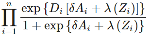

```{r}
library(dplyr)
library(ggplot2)
library(gridExtra)
library(MASS)
library(fitdistrplus)
library(ggstatsplot)
library(tibble)
library(readr)


```

-   Como una regla heurística, se considera que debería haber al menos 10 observaciones de 1 o 0 por cada variable predictora. Por ejemplo, si y = 1 solo 30 veces en n = 1000 observaciones, el modelo no debería tener mas de tres variables predictoras, aunque el tamaño total de la muestra fuera grande

-   En regresión logística, cuando un coeficiente es demasiado grande, con 3 digitos a más, en términos más generales, significa que probablemente esté intentando hacer "demasiado" con su modelo para el tamaño de su conjunto de datos (particularmente la cantidad de resultados observados). Es decir, para alguna combinación de parámetros, o todos obtuvieron el resultado o nadie tuvo el resultado, por lo que el coeficiente se dirige hacia el infinito (o el infinito negativo).

```{r}
setwd("C:/hcgalvan/Repositorios/hcgalvan_project/data/union/End")
temp = gsub(".*target.*", "", readLines("cofunds_A.csv"))
data<-read.table(text=temp, sep=",", header=TRUE)
dataf<-data.frame(data)

```

### Regresión Logística de A en X (X = confusoras)

1.  Realizamos sobre D=1 (Sujetos de estudio), regresión logística de A en X, donde:

-   El feature A tiene valor 0 y 1, equivalente a decir 0=No Expuesto, 1=Expuesto. Se forma a partir de la composición de todos features seleccionados como predictoras.
-   En una etapa anterior estas predictoras, features numéricos continuos, se los ajustó a su distribución de densidad originante, todas distribuciónes normales. Ver estudio "*Ajuste por distribución*"
-   Con los quantiles 1 y 3 de esta distribución originante se genera un nuevo feature para cada feature predictora, con valor 0="No expuesto", son aquellos sujetos que caen dentro de los límites de los cuantiles 1 y 3, valor 1=Expuesto, aquellos sujetos de la muestra que están fuera de los límites establecidos.
-   Se aplica un filtro a cada sujeto de la muestra que selecciona al 1="Expuesto", en cada feature resultante y se los deja como expuesto en el nuevo feature A, para aquellos que solo logran combinaciones de 1 y 0 se los deja como 0=No expuesto.

2.  Se van realizando diferentes pruebas para obtener una regresión lo más parsimónica posible, buscando la optimización en una muestra de pocas observaciones.

-   Como la cantidad de features son cercanos a 34, realizamos PCA y luego utilizamos las confusoras seleccionadas de los DAG realizados.

-   El resultado: las confusoras del DAG fueron seleccionadas porque convergen más rápidamente.

3.  Una vez logrado ajuste y comprobado la bondad de ajuste y los supuestos, se utilizará los coeficientes para generar las puntuaciones (propensity Z score)

```{r}

tag<-filter(dataf, label==0)
# Modelo de regresión logística
logmodel <- glm(A ~ age + sl2l_iso, data = tag, family = binomial())


# Bondad de ajuste del modelo Devianza y Chi2
# Para saber la eficacia del modelo prediciendo la variable respuesta utilizamos el estadístico chi-cuadrado, que mide la diferencia entre el modelo en su estado actual y el modelo cuando sólo se incluyó la constante.

dev <- logmodel$deviance
nullDev <- logmodel$null.deviance
modelChi <- nullDev - dev
modelChi


#como la probabilidad es menor que 0.05, podemos rechazar la hipótesis nula de que el modelo es mejor prediciendo la variable resultado que si elegimos por azar. Por tanto, podemos decir que, en general, el modelo tiene una aportación significativa en la perdición
chigl <- logmodel$df.null - logmodel$df.residual
chisq.prob <- 1 - pchisq(modelChi, chigl)
chisq.prob

# R^2
R2.hl <- modelChi/logmodel$null.deviance
R2.hl
#coeficientes y z-statistic
summary(logmodel)$coefficients

# Odds ratio
exp(logmodel$coefficients)
## intervalos de confianza
exp(confint(logmodel))


# Diagnóstico del modelo
tag$probabilidades.predichas <- fitted(logmodel)
tag$studentized.residuals <- rstudent(logmodel)
tag$dfbeta <- dfbeta(logmodel)
tag$dffit <- dffits(logmodel)
tag$leverage <- hatvalues(logmodel)

head(tag[, c("age", "sl2l_iso","probabilidades.predichas")])
head(tag[, c("leverage", "studentized.residuals", "dfbeta")])

# Selección del modelo
modelog <- glm(A ~ age+sl2l_iso, data = tag, family = binomial())
summary(modelog)
step(modelog, direction = "backward")

####################################################
# Supuestos del modelo Linealidad
tag$logageInt <- log(tag$age) * tag$age
tag$logsl2lInt <- log(tag$sl2l_iso) * tag$sl2l_iso
#df$logvar2Int <- log(df$var2) * df$var2

linealidad <- glm(A ~ age + sl2l_iso + logageInt + logsl2lInt, 
    data = tag, family = binomial())
summary(linealidad)

## multicolinealidad
library(car)
vif(modelog)
AIC(modelog)
```

#### Función de regresion logistica para obtener or, ci

```{r}
logistic.regression.or.ci <- function(regress.out, level = 0.95) {
  usual.output <- summary(regress.out)
  z.quantile <- stats::qnorm(1 - (1 - level) / 2)
  number.vars <- length(regress.out$coefficients)
  OR <- exp(regress.out$coefficients[-1])
  temp.store.result <- matrix(rep(NA, number.vars * 2), nrow = number.vars)
  for (i in 1:number.vars) {
    temp.store.result[i, ] <- summary(regress.out)$coefficients[i] +
      c(-1, 1) * z.quantile * summary(regress.out)$coefficients[i + number.vars]
  }
  intercept.ci <- temp.store.result[1, ]
  slopes.ci <- temp.store.result[-1, ]
  OR.ci <- exp(slopes.ci)
  output <- list(
    regression.table = usual.output, intercept.ci = intercept.ci,
    slopes.ci = slopes.ci, OR = OR, OR.ci = OR.ci
  )
  return(output)
}
```

#### Agregar Zscore para reemplazar a X en la ecuación

Con la regresión logística de A en X a partir de sujetos de control, utilizamos los coeficientes para generar las puntuaciones zscore en todas las observaciones del estudio (sujetos de control y sujetos de estudio)

```{r}
tag <- tag %>% 
  mutate(zscore = (1/(1+exp(-(as.numeric(unlist(modelog$coefficients[1]))+as.numeric(unlist(modelog$coefficients[2]))*tag$age+as.numeric(unlist(modelog$coefficients[3]))*tag$sl2l_iso)))))
```

#### Encontrar delta δ de Ai — Delta (mayúscula Δ, minúscula δ)

El escalar δ es la varianza obtenida en la regresión logística de A en X. Como se sabe este valor se logra con el ratio entre desviación que tiene el modelo y la desviación de los predichos.

```{r}
logistic.regression.or.ci(logmodel)

δ<-deviance(logmodel)/df.residual(logmodel) # ratio varianza

coef(modelog)
exp(coef(modelog))
# deviance(fit.reduced)/df.residual(fit.reduced)
δ
```

#### Pruebas generales

```{r}
#library(fixest)
#fitstat(logmodel, "g", simplify = TRUE)
library(lme4)
A ~ age+sl2l_iso
logistic_MLM0 <- glmer(A ~ (1|age) + (1| sl2l_iso), data=tag, family="binomial")
logistic_MLM1 <- glmer(A ~ age + (1| sl2l_iso), data=tag, family="binomial")
summary(logistic_MLM0)
summary(logistic_MLM1)

```

### [Rediseñar la base para el estudio causalidad]{.underline}

```{r}
dbd <- dataf[,c("A","label")]
dbd<- dbd %>% 
        mutate(zscore = (1/(1+exp(-(as.numeric(unlist(modelog$coefficients[1]))+as.numeric(unlist(modelog$coefficients[2]))*dataf$age+as.numeric(unlist(modelog$coefficients[3]))*dataf$sl2l_iso)))))
```

```{r}
write.csv(dbd, "C:\\hcgalvan\\Repositorios\\hcgalvan_project\\data\\union\\End\\zscore.csv", row.names=FALSE)
```

### Obtener funcion λ en Zi

#### ALTERNATIVA 1 - Aproximar con función no paramétrica λ de Zi

La letra griega lambda (Mayuscula -\>**Λ** , Minúscula -\> **λ**)

Tenemos 2 opciones por spline o regresion logística estratificada. Buscamos en este estudio por spline. Realizamos ambos estudios analíticos para ver su convergencia, sin embargo la limitación de estos métodos tiene que ver con el tamaño de muestra que poseen las features predictoras.

En el siguiente paso realiza en siguiente proceso:

1.  A partir de las diferencias entre cada observación o registro, se verifica el signo y si la diferencia es -2 entonces se busca el indice del dataframe y se suma 1 o dicho de otro modo se agrega una posición más. Este valor se guarda en unal ista.
2.  Se calcula el spline en coordenadas x e y, luego se plotea
3.  Se realiza ajuste de regresión lineal de los splines.
4.  Cuál es la idea detras de la regresion por tramo o nudos? generar
5.  <https://copyprogramming.com/howto/spline-interpolation-in-r>

```{r}
library(splines) # para utilizar con lm()
# vector of values
# tag[,c("zscore")]
# La Función sign() encuentra el signo de los elementos del vector numérico
# La función diff() en R se utiliza para obtener la diferencia entre cada elemento de un vector de forma consecutiva
# 
# La funcion which() devuelve la posición o indice de la condicion satisfecha.
h<-dbd$zscore
# local maxima I obtain local maxima by utilizing the diff function.

lmax <- h[c(1, which(diff(sign(diff(h)))==-2)+1, length(h))]

# spline calculation
spl <- spline(1:length(lmax), lmax)

# visual inspection
plot(spl)
lines(spl)
length(h)

#spl es x
h<-dbd$zscore
plot(h)
## utilizo el valor AIC de logistic regression de A en X para los degree
max(dbd$zscore)
min(dbd$zscore)
modelo2<-lm(spl$y~bs(spl$x,degree = 30.56, knots = lmax ))
modelo3<-lm(spl$y~bs(spl$x,degree = 30.56 ))
modelo4<-lm(h~bs(h,degree = 30.56 ))
modelo5<-lm(h~bs(dbd$A,degree = 30.56 ))
modelo6<-lm(h~bs(dbd$subclass,degree = 30.56 ))
modelo6<-lm(h~bs(dbd$subclass ))
modelo7<-lm(dbs$h~bs((1:length(h)),degree = 30.56))
spline <- glm(spl$y~ns(spl$x, knots = lmax ))
m=model.matrix(~bs(spl$x,degree = 30.56))
# prd=exp(coefficients(modelo3) %*% t(m)) como el mío no es logaritmo
prd=(coefficients(modelo3) %*% t(m))
prd[18]
dbd$zscore[18]

spline
summary(modelo4)
summary(modelo2)
modelo2
summary(modelo3)
summary(modelo5)
summary(modelo6)
summary(modelo7)
dbd$zscore[1]
predict(modelo3)
predict(modelo4)
data = data.frame(dbd$zscore[1])
dbd$zscore[1]
data
predict(spline, data, type="response")

#gráfico del modelo
pre2<-predict(modelo2)
pre3<-predict(modelo3)
pre4<-predict(modelo4)
pre5<-predict(modelo5)
pre6<-predict(modelo6)
plot(spl$x,spl$y,pch=16)
lines(spl$x,pre2,lwd=2,col="red")
lines(spl$x,pre3,lwd=2,col="blue")
plot(h,pch=16)
lines(h,pre4,lwd=2,col="blue")
plot(dbd$A,h,pch=16)
lines(dbd$A,pre5,lwd=2,col="red")
plot(h,dbd$subclass,pch=16)
plot((1:length(h)),h,pch=16)
lines((1:length(h)),predict(modelo6, dbd$zcores),lwd=2,col="red")
lines(pre6,lwd=2,col="red")
plot((1:length(h)),h,pch=16)

plot
```

```{r}
library(pacman)
p_load(kirkegaard, rms)
```

```{r}
library(arules)
d = tibble(
  x = 1:100,
  
  #even spline
  k2_even = discretize(x, breaks = 3, labels = "number"),
  
  #default split used in rms - 10, 50, 90th centiles
  k2_default = c(rep(1, 10), rep(2, 80), rep(3, 10)),
  
  #generate linear spline values
  linear_spline = case_when(k2_even == 1 ~ x*1,
                 k2_even == 2 ~ x*0 + 34,
                 k2_even == 3 ~ x*2 - 100),
  
  #natural spline values -- actually a polynomial
  natural_spline = 1*x + 5*x^2 - .1*x^3
)
```

```{r}

###Linear spline
i_fit = ols(as.formula(glue::glue("linear_spline ~ lsp(dbd$zscore)")), data = d)

###Natural spline
i_fit = ols(as.formula(glue::glue("natural_spline ~ rcs(x, 3)")), data = d)
```

Xi​ (en mayúscula **Ξ**, en minúscula **ξ**

<https://bmcmedresmethodol.biomedcentral.com/articles/10.1186/s12874-019-0666-3>

```{r}
#####ALTERNATIVA DE SPLINE#######
#library(survival)
library(splines2)
library(graphics)

bsMat <- bSpline(dbd$zscore)

matplot(dbd$zscore, bsMat, type = "l", ylab = "Piecewise constant B-spline bases")
abline(v = knots, lty = 2, col = "gray")
```

#### ALTERNATIVA 2 - Utilizar stratified logistic regression

Pasos realizados:

1.  Genero los estratos de quantiles a partir de propensity Z score.
2.  Genero stratified logistic regression de D en A condicionado por estratos.
3.  Verifico p-value de validez de estudio

<https://www.youtube.com/watch?v=4jWcf4nkUWk>

<https://www.practicalpropensityscore.com/stratification.html>

```{r}
#generate statrum to quantile of zcore values continuos
dbd$subclass <- cut(x=dbd$zscore,
                              breaks=quantile(dbd$zscore, 
                              prob = seq(0, 1, 1/5)),include.lowest=T)
levels(dbd$subclass) <- 1:length(levels(dbd$subclass))

```

```{r}
#examine common support
xtabs(~A+subclass,dbd) #table of counts per stratum
```

```{r}
library(tidyverse)
library(gtsummary)
library(survey)
## regresión logística estratificada utilizando datos ponderados

design<-svydesign(id=~1, data = dbd, weights = ~zscore, strata = ~subclass)

reg1 <- svyglm(
  label ~ A,
  family = binomial,
  design = subset(design, subclass=="1"))
summary(reg1)
tbl_regression(reg1)

reg2 <- svyglm(
  label ~ A,
  family = binomial,
  design = subset(design, subclass=="2"))
summary(reg2)
tbl_regression(reg2)

reg3 <- svyglm(
  label ~ A,
  family = binomial,
  design = subset(design, subclass=="3"))
summary(reg3)
tbl_regression(reg3)
```

```{r}
# regresion logística condicional o estratificada
# Realizo reg log de label(D) en A con estratos de quantiles obtenidos de zcore.
# En este caso p-valor indica que no es significativo la inferencia obtenida. Lo que hace suponer la baja cantidad de observaciones.

survival.clogit <-clogit(label~A+strata(subclass),data=dbd)
summary(survival.clogit)
```

A partir de los valores anteriores obtenidos se genera la ecuación final de predicción.



```{r}

productoria <- function(D,lambda,a,deltaz){
   result = prod((exp(D*(lambda*a)+deltaz))/(1+exp((lambda*a)+deltaz)))
   return(result)
}

v<-c()

for (variable in sbd) {
  v[variable] <- -(lik(variable,x))
}

plot(v)
abline(v=10,col="red")

```
