#### **Primer meta operativa:**

1.  Obtener Funcion densidad y parámetros de features sl2l_diameter.

#### Condiciones a tener en cuenta:

-   Los features son continuas

-   Tienen una partición referida a sujetos de control y estudio

-   Buscamos una sola F, Media y Sd univariada que reuna a esta partición

-   Desconocemos distribución de densidad,

-   Desconocemos parámetros: esperanza y varianza

#### Método de selección:

-   Se busca obtener estimación puntual de: a) densidad y b) parámetros con menor error posible.

-   Buscar comportamiento asintóticamente normal o distribución asintótica en estimadores.

-   Buscar consistencia en estimadores

#### Estrategias utilizadas:

-   Quitando los "outliers" y ajustando a distribución. Los "outliers" generan ruido y distorciona.

-   Sin quitar outliers con ajuste de distribución: Sin quitar los atípicos, ajustamos y fijamos a una distribución paramétrica, donde los supuestos son restrictivos y es mas eficiente.

-   Sin quitar outliers sin ajuste de distribución: Sin quitar los atípicos, pensamos en una distribución suave, utilizando diferentes métodos no paramétricos.

### CONCLUSION ANALISIS sl2l_diameter

El análisis realizado sobre diferentes metodologías, tanto paramétricas como no paramétricas, se obtiene que si bien no conocemos la distribución y tampoco conocemos sus parámetros, al limpiar sus valores atipicos, logramos ajustar a una distribución normal con sus parámetros media y desv standar que son insesgados, que nos permite utilizar las propiedades de LGN (ley de los grandes números) que nos ayuda en mejorar el estimador convergiendo a la media y varianza poblacional y a traves de TCL (teorema central del límite) que con muestras grandes \> 30, nos indica que los valores de estimadores puntuales se aproximan a la distribución normal.

### FEATURES : sl2l_diameter

### AJUSTANDO A DISTRIBUCIÓN - CON / SIN QUITA DE ATIPICOS

Los primeros 2 boxplot se refieren a sujetos de control y estudio. El tercer gráfico es en forma conjunta. El cuarto boxplot, fue parcialmente quitado los outliers y el último gráfico esta completamente limpio de outliers para el conjunto de datos de control y estudio.

#### GRAFICA DE OUTLIERS

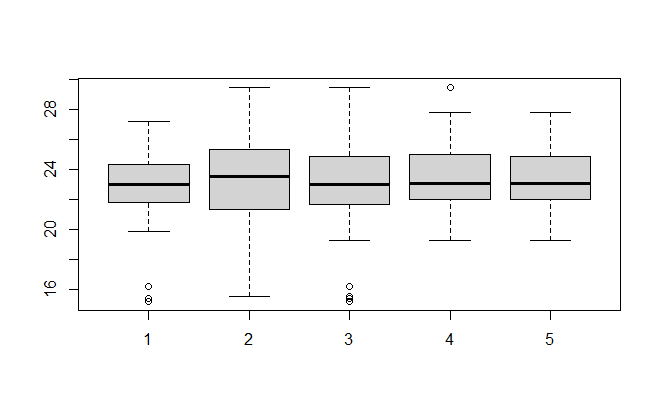{width="497"}

#### GRAFICAS DE DENSIDAD EMPIRICA

Gráfica 1

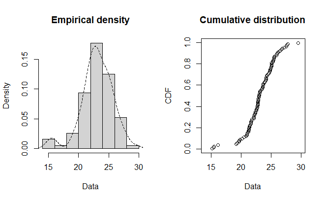{width="533"}

Gráfica 2 - Con quita parcial de outliers

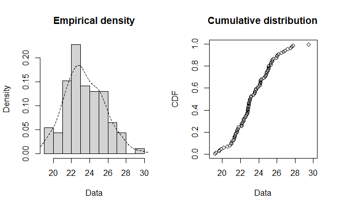{width="505"}

Grafica 3 - Con quita de outliers

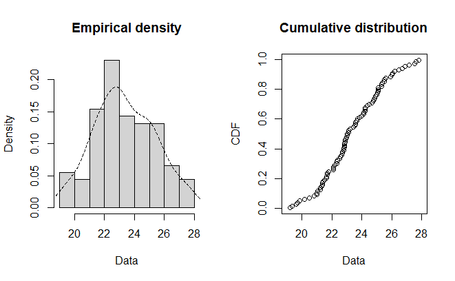{width="522"}

Gráfica de la distribución de densidad y la curtosis teórica vs punto central de la muestra sin outliers con bootstrap que permite observar el comportamiento experimental de tener 1000 observaciones. Indicando el punto de observación el valor cercano a la normal.

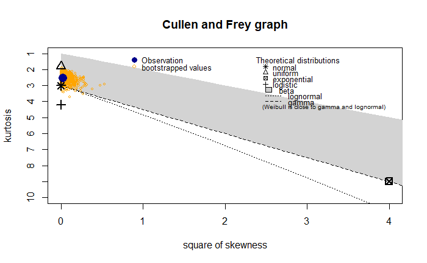{width="596"}

La gráfica muestra la muestra sin ajuste, haciendo bootstrap y también se observa la distancia del centro de la muestra observado vs la curtosis de cada distribución teórica.

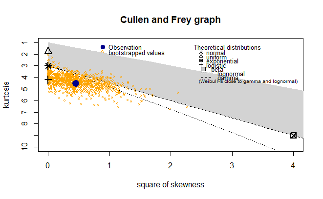{width="553"}

Descriptivas

```         
Descritiva de estimadores sin outliers
Min. 1st Qu.  Median    Mean 3rd Qu.    Max.
19.22   21.94   23.03   23.35   24.87   27.80     

Descriptiva de estimadores parcialmente quitados los outliers
Min. 1st Qu.  Median    Mean 3rd Qu.    Max.    
19.22   22.01   23.06   23.42   24.91   29.45     

Descriptiva de estimadores con outliers
Min. 1st Qu.  Median    Mean 3rd Qu.    Max.    
15.17   21.66   22.99   23.09   24.86   29.45 
```

### Ajuste de la muestra a Distribución Teórica (normal y logística)

Ajustamos a una distribución utilizando max likelihood

a)  Ajuste a **distribución teórica Normal** de *muestra sin valores atípicos*

|      |  estimate | Std. Error |
|:-----|----------:|-----------:|
| mean | 23.353744 |  0.2086411 |
| sd   |  1.990309 |  0.1475314 |

b)  Ajuste a **distribución teórica Normal** de *muestra con quita parciales valores atípicos*

|      |  estimate | Std. Error |
|-----:|----------:|------------|
| mean | 23.420027 | 0.2166463  |
|   sd |  2.077999 | 0.1531919  |

c)  Ajuste a **distribución teórica Normal** de *muestra con valores atípicos*

|      |  estimate | Std. Error |
|:-----|----------:|-----------:|
| mean | 23.092600 |  0.2623940 |
| sd   |  2.570926 |  0.1855405 |

e)  Ajuste a **distribución teórica Logística** de *muestra con valores atípicos*

|          |  estimate | Std. Error |
|---------:|----------:|------------|
| location | 23.193508 | 0.2432675  |
|    scale |  1.384082 | 0.1186490  |

#### Cuantiles para cada distribución ajustada

a)  Buscamos la mediana o cuantil D5-\>50% de probabilidad de que el valor esté por encima como por debajo de esa cifra

|          |                          |                              |                          |                              |
|----------|--------------------------|------------------------------|--------------------------|------------------------------|
|          | Sin valores atipicos \~N | Parcial valores atipicos \~N | Con valores atipicos \~N | Con valores atipicos \~Logis |
|          | p=0.05                   | p=0.05                       | p=0.05                   | p=0.05                       |
| estimate | 20.07998                 | 20.00202                     | 18.8638                  | 19.11816                     |

### Test de HIPOTESIS de estimador con respecto a la distribución

```         
*********MUESTRA CON ATIPICOS         *************
Goodness-of-fit statistics
                                norm      Logis 
Kolmogorov-Smirnov statistic 0.08161389 0.05308165 
Cramer-von Mises statistic   0.10233156 0.03623999 
Anderson-Darling statistic   0.85997624 0.35763507  

Goodness-of-fit criteria       
                                norm    Logis 
Akaike's Information Criterion  457.7353 452.1545 
Bayesian Information Criterion  462.8640 457.2832 

*********MUESTRA SIN ATIPICOS         *************
Goodness-of-fit statistics                                    
                                norm      Logis 
Kolmogorov-Smirnov statistic 0.07216626 0.06666179 
Cramer-von Mises statistic   0.05572654 0.06753086 
Anderson-Darling statistic   0.30973383 0.41374850  

Goodness-of-fit criteria                                    
                                norm    Logis 
Akaike's Information Criterion 387.5156 391.4517 
Bayesian Information Criterion 392.5373 396.4734 

*********MUESTRA SIN ATIPICOS PARCIALES*************
Goodness-of-fit statistics                                    
                                norm      Logis 
Kolmogorov-Smirnov statistic 0.07718240 0.06822624 
Cramer-von Mises statistic   0.05911419 0.06357176 
Anderson-Darling statistic   0.32141784 0.38707890  

Goodness-of-fit criteria                                    
                                norm    Logis 
Akaike's Information Criterion 399.6632 402.1887 
Bayesian Information Criterion 404.7068 407.2323
```

### SIN AJUSTE DE DISTRIBUCION - SIN QUITA DE ATIPICOS

Solo se considera que la distribución de densidad es suave

#### Estimación de parámetros

-   La diferencia ente EMM y EMV es que la varianza en EMM es insesgado y no ocurre cuando se estimad con EMV que sí es asintóticamente insesgada

    | Estimación        | EMM      | EMV      |
    |-------------------|----------|----------|
    | Media muestral    | 23.0926  | 23.0926  |
    | Varianza muestral | 6.609659 | 6.609659 |

-   Desviacion estandar sqrt(6.609659) = 2.570926

#### Test de hipótesis para estimador de Maxima Verosimilitud (MLE) y momentos (MME)

```         
Goodness-of-fit statistics                               
                             Logis mle  logis mme 
Kolmogorov-Smirnov statistic 0.05308165 0.05980909 
Cramer-von Mises statistic   0.03623999 0.05745587 
Anderson-Darling statistic   0.35763507 0.46226417  

Goodness-of-fit criteria                                
                              Logis mle logis mme 
Akaike's Information Criterion  452.1545  452.3934 
Bayesian Information Criterion  457.2832  457.5221
```

#### Estimación de densidad Compromiso-Sesgo Varianza y Convalidación Cruzada

Método de Kernel y Bandwith (ventana)

Estimación densidad parzen y LSCV (validación cruzada de mínimos cuadrados)

Búsqueda de ventana a partir de la muestra con diferentes estrategias:\
valores obtenidos para realizar test: a) 1.101516, b) 3.011, c) 6.349,

```         
*** HERRAMIENTAS ***
Nonparametric Robust Estimation and Inference Methods using
Local Polynomial Regression and Kernel Density Estimation
Herramienta kdrobust(x)

Call: kdrobust

Sample size (n)                            =     96
Kernel order for point estimation (p)      =     2
Kernel function                            =     Epanechnikov
Bandwidth selection method                 =     imse-dpi

=============================================================================
                                     Point      Std.       Robust B.C.       
          eval        bw   Eff.n      Est.     Error      [ 95% C.I. ]       
=============================================================================
1       20.339     3.011      33     0.079     0.009     [0.046 , 0.096]     
2       20.991     3.011      49     0.105     0.010     [0.079 , 0.133]     
3       21.168     3.011      50     0.111     0.010     [0.088 , 0.144]     
4       21.321     3.011      54     0.116     0.010     [0.095 , 0.152]     
5       21.421     3.011      55     0.120     0.010     [0.099 , 0.157] 


herramienta kdbwselect(x, bwselect="imse-dpi")
---- Utilizamos nucleo epa y búsqueda de ventana a traves de metodos: Plug-in y regla de oro.


Sample size (n)         =    96 
Kernel function         =    Epanechnikov Bandwidth 
selection method        =    imse-dpi  
=======================        
h        b 
=======================     
3.011     6.349 
======================= 
Call: kdbwselect  

Sample size (n)         =    96 
Kernel function         =    Epanechnikov Bandwidth selection
method                  =    imse-rot  
=======================        
h        b 
=======================     
2.427     6.349 
=======================

**********************************
Por otrora utilizamos, selector univariante LSCV de Bowman (1984) y Rudemo (1982)
Hlscv: Least-squares cross-validation (LSCV) bandwidth matrix selector for multivariate data

hlscv(data$sl2l_diameter) 
[1] 1.101516 
```

#### Análisis de distribución de densidad con sus estimadores de parámetros:

Gráfico - Densidad con estimador parzen, nucleo gauss y ventana = 1.101516 obtenida con kdrobust

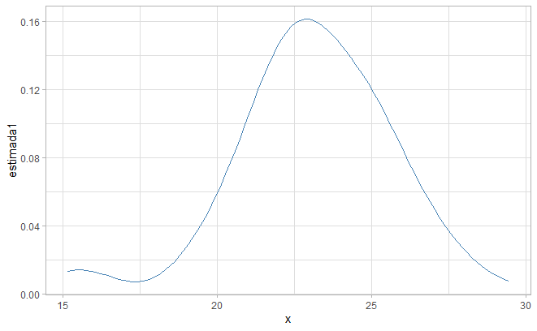{width="434"}

Grafico - Densidad con estimador parzen, nucleo gauss y ventana = 3.011obtenida con LSCV de Bowman (1984)

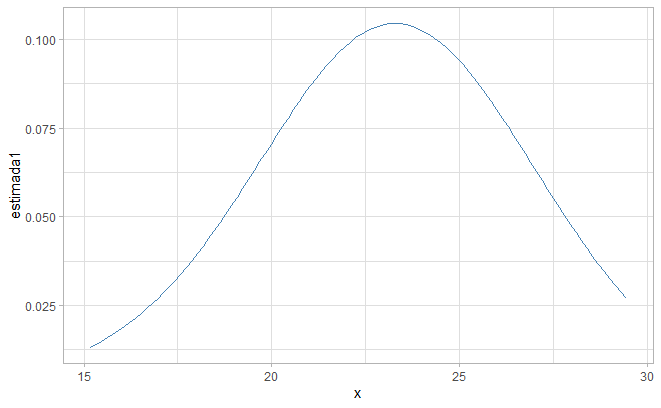{width="422"}

Grafico - Densidad con estimador parzen, nucleo gauss y ventana = 6.349 obtenida con kdbwselect

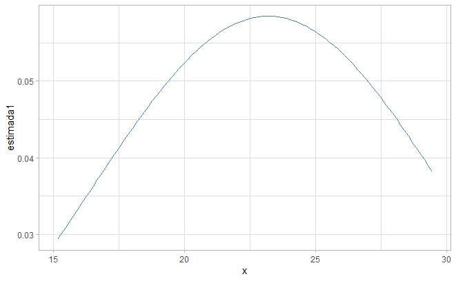{width="426"}

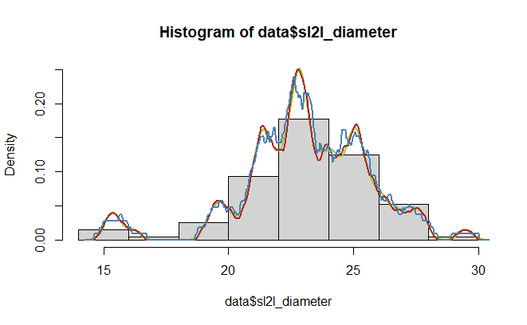{width="441"}

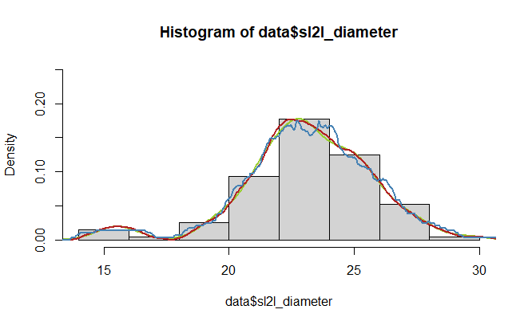{width="418"}

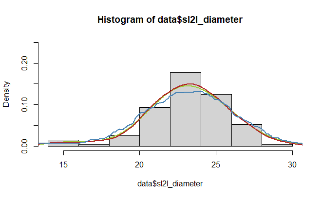{width="421"}

```         

       x           estimada1
Min.   :15.17   Min.   :0.007465
1st Qu.:18.74   1st Qu.:0.014230    
Median :22.31   Median :0.051236    
Mean   :22.31   Mean   :0.067819    
3rd Qu.:25.88   3rd Qu.:0.120650    
Max.   :29.45   Max.   :0.161562  
```

```         
       x           estimada1        
 Min.   :15.17   Min.   :0.01324  
 1st Qu.:18.74   1st Qu.:0.03740  
 Median :22.31   Median :0.06541  
 Mean   :22.31   Mean   :0.06407  
 3rd Qu.:25.88   3rd Qu.:0.09283  
 Max.   :29.45   Max.   :0.10450  
```
